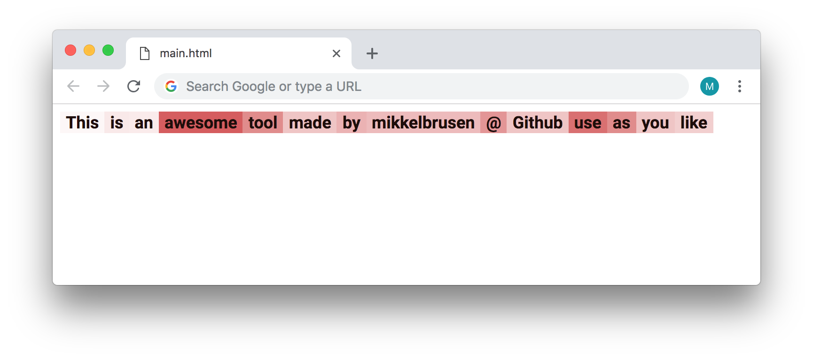

# Visualize text with colors based on weights 
Visualize an array of strings with a color corresponding to its weight speciefied in an array. 
The minimum and max weight will be determined from the weight array, and those will be the coldest and warmest colors repectively.

Use as you wish, and feel free to give credit if you like.

